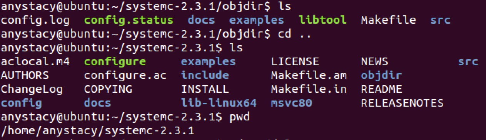
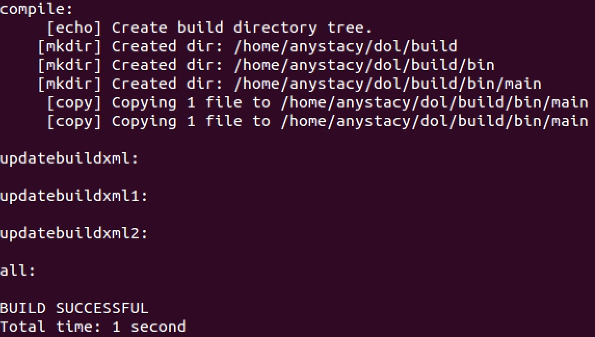

# DOL 安装笔记 
本次报告是包括对DOL的概述、DOL安装过程中的安装笔记，和实验感想与心得。  
  

## Description
>DOL 框架描述(随着实验进行迭代添加、修改)  

**Distributed Operation Layer (DOL)**  
The distributed operation layer is a software development framework to program parallel applications. The DOL allows to specify applications based on the Kahn process network model of computation and features a simulation engine based on SystemC.   
Moreover, the DOL provides an XML-based specification format to describe the implementation of a parallel application on a multi-processor systems, including binding and mapping.

The distributed operation layer (DOL) is a framework that enables the (semi-) automatic mapping of applications onto the multiprocessor SHAPES architecture platform. The DOL consists of basically three parts:  

DOL Application Programming Interface  
DOL Functional Simulation  
DOL Mapping Optimization

## How to install
>DOL 安装笔记  
>(由于是安装成功后再次实现，因此截图可能会有些文件已存在的提示，截图中还可能省略很多中间过程内容，不影响结果)  

1. 配置C/C++ environment: compiler, linker  

2. Java environment: javac, java 配置  
	- 解压jdk配置安装包
	
	- 配置环境变量：在文件末尾加上标准格式JDK所在路径
	 
	- 配置默认JDK，查看JDK版本:
	有三个可选的候选项，选择刚配置的1.8版本的JDK默认使用；查看JDK和JAVA版本正确
	
	
3. Build environment: make, Ant 更新环境  
	- update 环境
	
	- ant 开发环境工具: 验证是否安装成功
	
	
4. 安装与配置SystemC  
   - 解压SystemC并运行configure，根据系统的环境设置参数用于编译
	  
	
	- 编译SystemC
	
   - 获取当前工作路径
   
   
5. 配置DOL  
	- 进入DOL文件夹，根据当前路径修改build_zip.xml文件中路径    
	 
	- 用ant语句编译该文件  
	    
	  
	- 尝试运行main目录中第一个例子
	
	  
	
6. 创建github库(Ubuntu和Macbook)  
	- 记录github用户信息，创建本地github库并上传文件
	
	- 获取系统SSH密钥，并添加入github帐户
	
	
	- 建立远程库origin，并将所有本地库内容上传到分支master
	
	
	- 在MAC系统中执行相似操作获得SSH密钥并关联到账户中，克隆github库到本地，并在克隆库中添加readme.md文件和图片文件，用一系列"add->commit->push"的操作上传(部分示例图如下)：
	
  
## Experimental experience
>实验感想、实验心得

这两次实验的过程中经历了很多的问题：  
1. 实验配置：配置的过程中起初使用的是ubuntu16.04版本，发现在环境配置步骤出现很多问题。后来卸载重装了14.04版本64位的系统，ppt中关于必要环境的安装不是很详细，我就发现更新完成后运行例子时会有"javac jdk"路径指向错误的问题。  
2. 当我找到对应的路径，发现该路径并不是jdk的安装路径，因此javac无法运行。因此我参照DOL配置文档再重新配置，手动安装java的jdk1.8，配置环境变量和默认jdk。获取jdk和java版本信息时就能看见三个候选项，选择手动配置生成的java路径，才能正常编译文件。最后尝试运行例子时，发现依旧有报错，在example1中的部分java语句被拒绝。改进方法是在运行指令ant前加上sudo就可以正常测试了。     
3. Github远程库建立：本周的任务是建立实验的Github库，将实验报告用markdown语言写成readme.md的形式上传到库中。首先在ubuntu中存入github的帐户信息，将ubuntu的SSH密钥上传到github设置中，之后的远程库配置就很容易了。  
4. 多远程库协作：我的目的是在ubuntu和我的本机mac中都建立一个远程库，这样方便以后实验多个远程库都可以上传修改文件。但我起初的想法过于复杂，涉及到多个支线的冲突解决，使我一度想放弃mac中的远程库。实际上操作很容易，只要将mac的SSH密钥也加入github，再在mac上克隆github的库，就可以直接在克隆库中修改和上传了。  
5. 实验感想：环境配置和远程库搭建是软件工程学生最基本的能力之一，这次实验也进一步强化了我们对于系统的一些错误报告的分析，善用搜索引擎去解决问题。期待下次的实验能进一步接触DOL框架～
