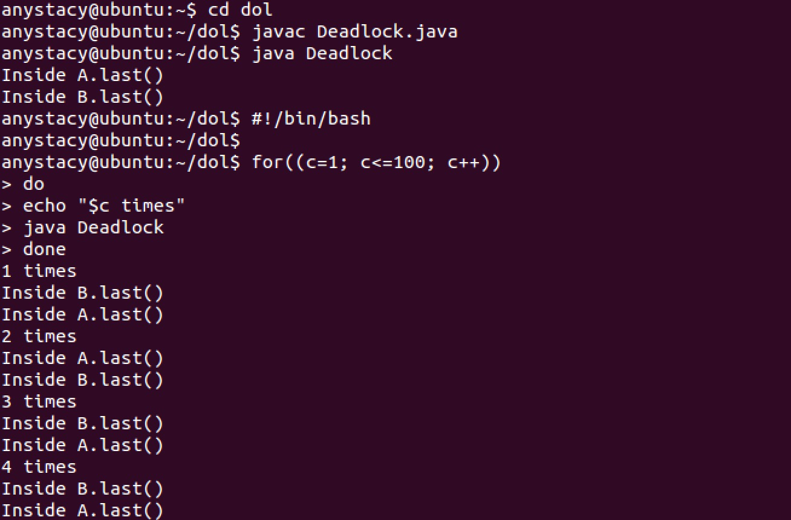

# Lab2: DOL实例分析&编程

## 实验任务

调整函数调用资源的延时实现死锁的情况，分析产生死锁的原因，和死锁产生的四个必要条件。

## 实验原理

1. 死锁就是两个或者多个进程，互相请求对方占有的资源。  
互斥条件：一个资源每次只能被一个进程使用  
请求与保持条件：一个进程因请求资源而阻塞时，对已获得的资源保持不放  
不剥夺条件:进程已获得的资源，在末使用完之前，不能强行剥夺  
循环等待条件:若干进程之间形成一种头尾相接的循环等待资源关系
2. 关键字 synchronized:
 - 当它用来修饰一个方法或者一个代码块的时候，能够保证在同一时刻最多只有一个线程执行该段代码。
 - 当一个线程访问object的一个synchronized同步代码块或同步方法时，其他线程对object中所有其它synchronized同步代码块或同步方法的访问将被阻塞。 
3. 调整Count的延时，延迟函数调用资源的时间，主要函数如下：
	  
这里是主函数的时间轴，当t.start(),之后，线程t就被插入到调度队列里，当调度到他的时候，就跑run()里面的代码
	
4. linux系统把下面这段到记事本里，然后保存为.sh，然将批处理文件放在java程序（Deadlock.class）目录下。目的是使程序Deadlock.java循环运行100次，观察死锁的情况。  
	

## 实验流程
1. 可以采用二分的方法调整count值，看看是偏大还是偏小； 	  
	编译java代码并循环运行Deadlock.jav一百次操作如下：
	 
2. 由于死锁的产生是因为：当类A的某个函数被调用，即类A资源被占用，当另一个对象b要调用类A的函数资源时，需要等待时间。但如果类A的这个函数也在申请对象b所在类的函数资源时，双方都会陷入无限的等待，即产生死锁。
3. 根据上述的分析，可以在类B的last函数中也加入count等待延时，使类B的函数methodB对类A的last函数的调用，比类A的对象对类A的methodA函数的调用稍早一点，或是两者同时调用。我将主函数延时调为60000，将类B的methodB函数延时调为60000，即让对象a和methodB同时调用类A的资源。
 	
4. 若还是无法死锁，只能将两个延时同步调大，直到死锁产生为止。我将两个延时同时增大10倍：
 	
 	
## 实验结果
#### 1.调整主函数延时增大2倍 
将主函数延时调为40000后，编译运行Deadlock的结果为：

没有产生死锁。同时，调小延时为10000也没有产生死锁。说明延时应该更大，或者在调用类A资源的函数methodB中也加入延时。在调用A的last函数之前，函数methodB先等待一段延时，再与对象a同时调用类A资源。  

#### 2.在函数methodB中加入相同长度延时
在调用A的last函数之前，将与主函数延时相等长度延时60000加入methodB函数后，编译运行Deadlock结果为：

还是没有产生死锁，但理论上来说类A资源已经能被同时调用造成死锁。因此只需要再同时调整增大两个延时即可。

#### 3.同时调整增大两个函数中延时
将主函数延时和methodB函数延时同时增大10倍，即为600000后，编译运行Deadlock结果为：

在第8次运行时产生死锁，实验成功。

## 实验感想
本次实验是对死锁产生条件和效果的简单实现与分析，目的是了解死锁的产生原理，同时学会调整延时实现一定的功能。 经过此次实验，我对死锁的产生有了更直观的理解。其实这次的实验很简单，主要是对代码的简单修改，在上学期操作系统课程的学习中我们学习了死锁产生的四个条件，即如下四个条件任意一个满足都会引起死锁：  
1. 互斥：至少有一个资源处于非共享模式，即一次只能有一个进程在使用；  
2. 占有并等待：一个进程必须占有至少一种资源，并等待一个并其他进程占有的资源；  
3. 非抢占：资源不能被抢占，只能在进程完成后自动释放；  
4. 循环等待。