# Lab2: DOL实例分析&编程

## 实验任务
1. 修改example2,让3个square模块变成2个  
    > tips: 修改xml的iterator 
     
2. 修改example1,使其输出3次方数
   > tips:修改square.c  
   
3. 提示: 修改代码之后要重新编译、运行(sudo ant –f runexample.xml –Dnumber=XXX)XXX是 运行example的号码,比如上面是2和1

## 实验原理

1. example中各文件的含义:   
src文件夹 -- 各进程(生产者,消费者,处理模块等)的功能定义 example1.xml -- 系统架构即模块连接方式定义  
2. /src 文件夹内包含2种文件: .c, 与对应的.h,就是实现的模块,就是*.dot的 框框的功能描述
3. 生产者(generator) -- 信号产生函数，示例一中其代码功能为：如果当前位置小于生产长度（在global.h文件中定义为20），则将x（即当前下标）写入到输出端，否则销毁进程。简单来说，就是产生数字1-19，并将它们写入到输出端。  
处理模块(square) -- 信号处理函数，示例一中其代码功能为：读入输入端信号i，并将其平方写出到输出端。  
消费者(consumer) -- 信号消费函数，示例一中其代码功能为：若当前位置小于设定长度，则读出输入端信号并且打印；否则销毁进程（停下来）。

## 实验流程
### 一、修改example1,使其输出3次方数
* 由于生产者函数、处理函数和消费者函数的作用如上，下面继续分析example1的进程定义、通道定义和连接定义：
	- Process  
 	name-定义实现的模块的名字，port type-定义端口类型输出或者输入，port name-定义端口的名字  
 	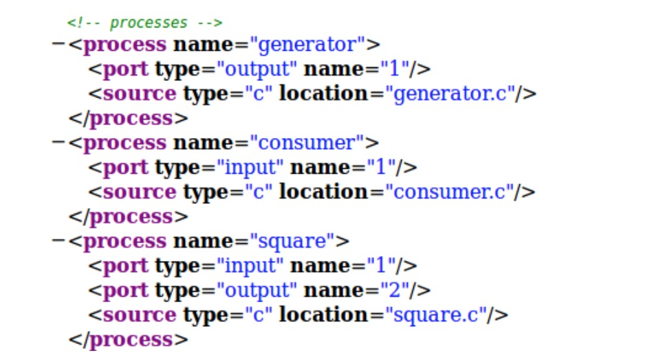  
	- Channel  
	通道定义，一条线就是一条通道。size-定义缓冲区的大小，在两个通道中都是10；name-定义这条通道的名字，分别为C1和C2
	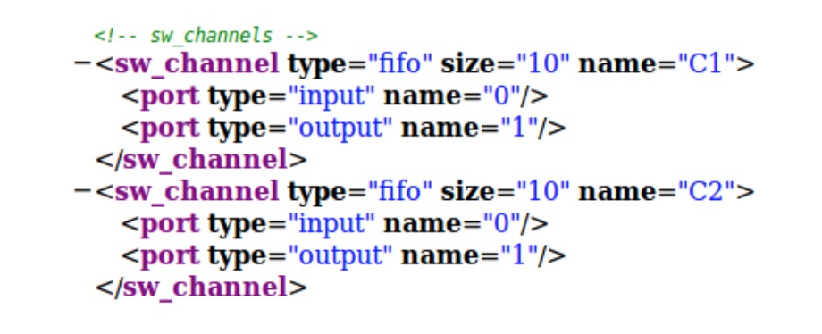  
	- Connection  
	定义各个模块之间的连接,一条线会对应两个 connection,就是A框的右手牵着这条线的左边, 这条线的右边牵着B框。name-定义这段连接的名字,随便填；origin name/target name-定义模块或者通道的名字；port name-要对应process或者channel的端口名
	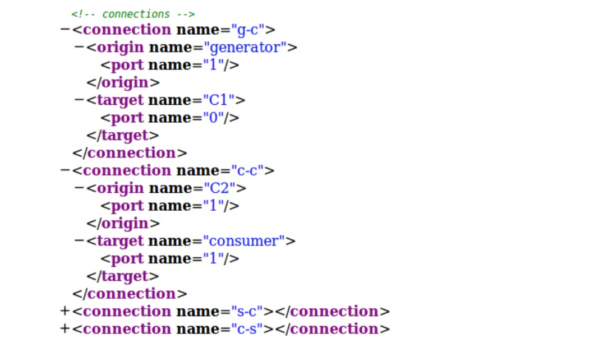
- 根据上述的分析，生产者模块输出端为1，消费者模块输入端也为1，而square模块有两个端口0和1；两个通道C1和C2也都有两个端口0和1。因此模块间连接的形式为：  
	**生产者－通道C1－square－通道C2－消费者**  
	也就是说，由生产者函数产生19个数字1-19，从通道C1传入square模块；square模块对数字进行平方计算，将结果从通道C2传入消费者函数；最后消费者依次读取结果，并输出length＝19个结果。  
- 题目二要求修改example1，使其输出三次方就很简单了。只需要修改信号处理函数square模块中，将生产者产生的数字平方化的过程改为立方运算就可以了：
	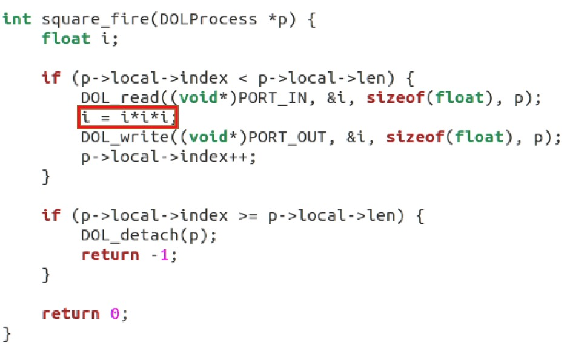
	
### 二、修改example2,让3个square模块变成2个
* 在example1中我已经分析了进程、通道和连接的定义，example2从根本上鱼ex1是相似的，唯一的区别在于ex2中包含三个square模块，也就是对生产者产生的数字进行了三次平方操作并在消费者函数中输出  
	- 在模块定义的部分，生产者和消费者函数之间有信号处理模块square的函数定义。特别的事，square函数被定义在一个迭代器iterator中，从1迭代到N，共创建了N个square函数。且每个square函数都有一个0输入端和一个1输出端。另外，这个变量N的大小在xml文件的开头被初始化为value＝3，即创建的square模块个数为3。
	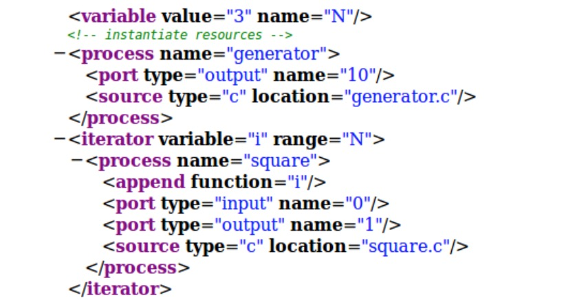
	- 同时，连接的创建也是迭代产生的。通过迭代，定义了N个通道C2和2N个连接，同样每个都有一个名字为“0”的输入端和名字为“1”的输出端：
 	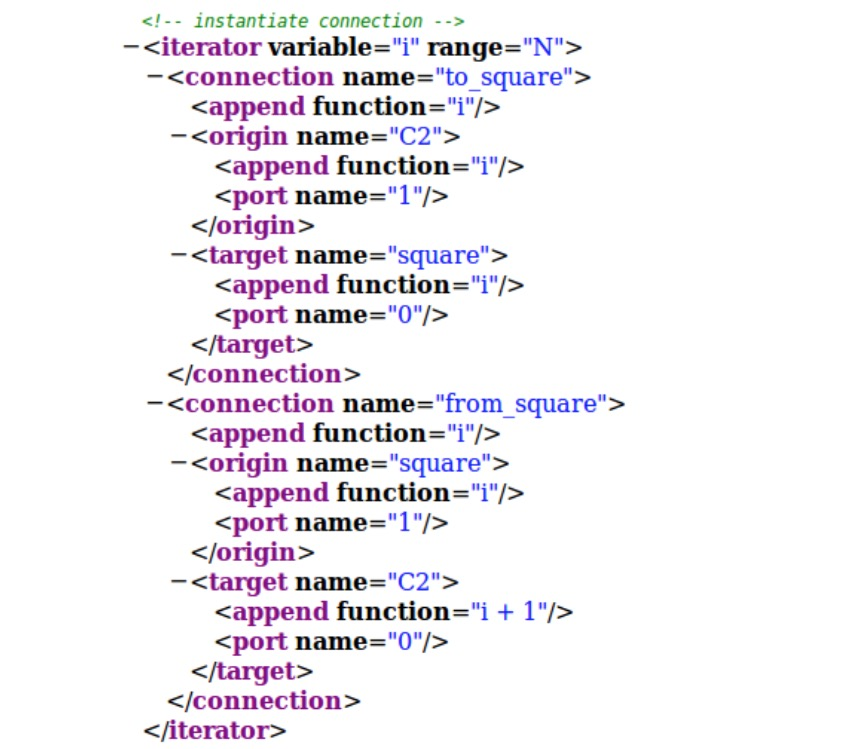
 	
* 因此题目一要求修改修改example2，让3个square模块变成2个，就只需要修改变量N的值，使square模块迭代创建的次数减为2次即可。
 	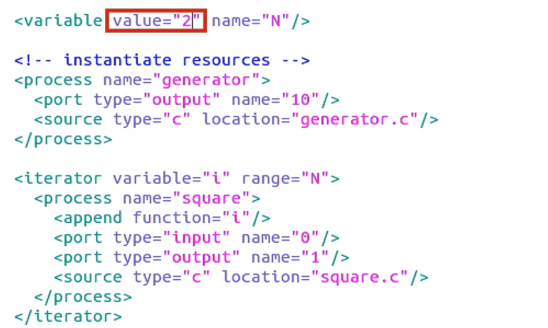
 	
 	
 	
## 实验结果
### 实验一
将square模块改为输出三次方后，编译运行example1的结果为：
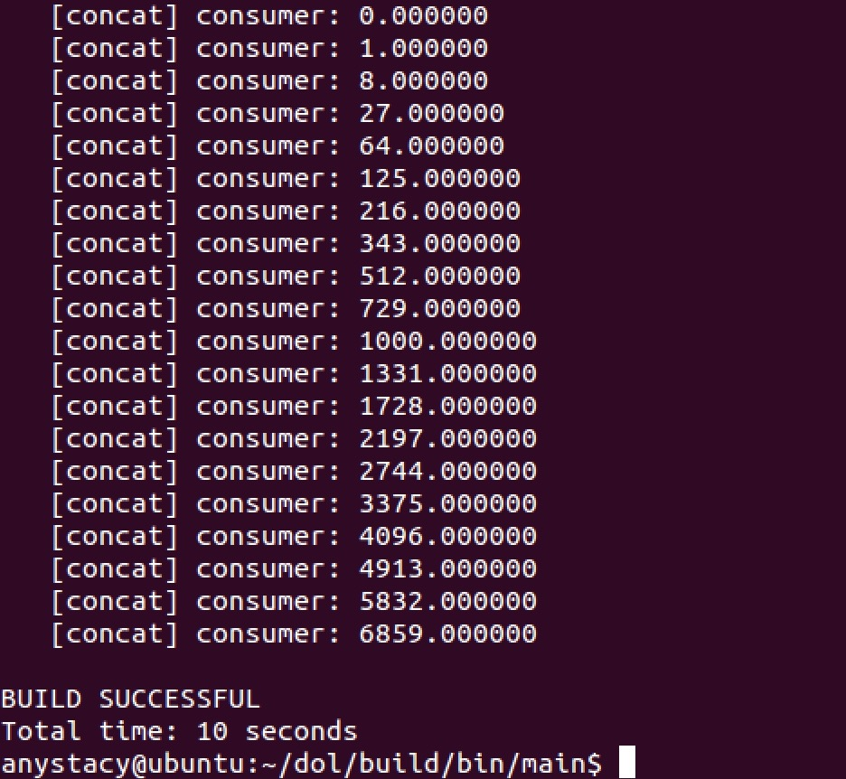
.dot图表示为：  
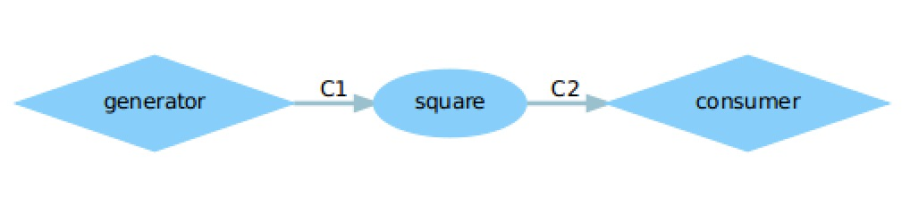  

### 实验二
将square模块变为两个后，编译运行example2后结果为数字1～19的四次方：
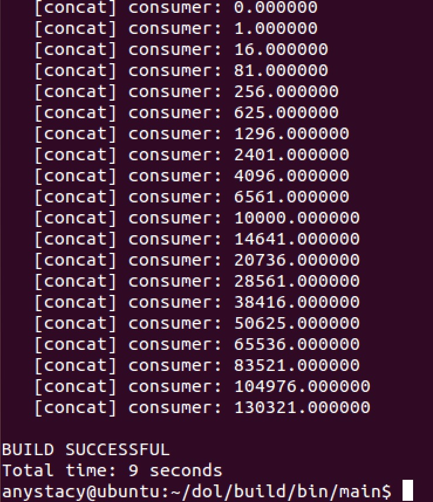
.dot图表示为：  
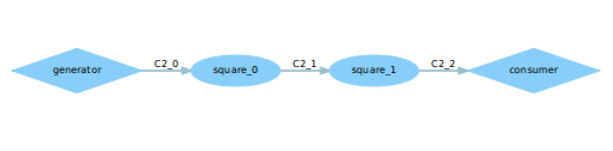  

## 实验感想
本次实验是对DOL实例的简单分析，目的是了解DOL的架构和example组成格式，同时学会修改函数实现一定的功能。 经过此次实验，我对DOL架构有了个初步的了解，也理解了代码的构成与原理。其实这次的实验很简单，主要是对代码的简单修改，只要理解了DOL的架构和example的组成情况，就能分析出example的实现目的，和各个函数的作用。因此在分析example时，根据ppt的提示和总结，我对示例的理解如下：  

* 首先通过generator、consumer和处理函数分析，各个函数主要的功能，以及函数之间的关联情况。
* 再在example.xml文件的process中可以看到示例包含了哪些，包含了多少生产者、数据处理和消费者模块；
* 在channel中可以看到文件定义了哪些通道，需要重点观察各个通道的端口号；
* 最后在connection中可以看到各个模块是如何通过通道相连接的，在脑海中构建一个dot图的基础模型。
 
