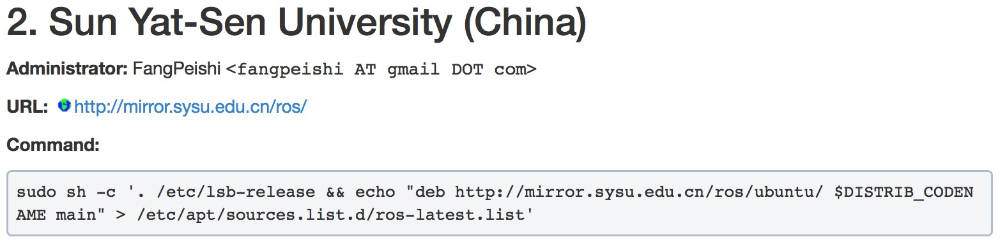
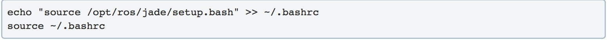

# ROS 安装笔记 
本次报告是包括对ROS的概述、ROS安装过程中的安装笔记，和实验感想与心得。  
  

## Description
>ROS 框架描述  

ROS就是一个分布式操作系统，通过节点node，主题topic，服务service等进行通信和控制。

这个机制就好比 两个人聊天微信，每个人都是一个节点node，微信这个软件的聊天功能就是Topic，两个人只有都通过微信才能聊天，如果一个人用whatsup，另一个人用微信，是收不到对方信息的。 而service就好比表情包或者微信朋友圈，两个人在聊天的同时也可以自己搞搞有趣的东西即Service，但是不一定非要通过微信的聊天功能即Topic。

ROS关键词： 编程语言 - C++/python， 架构 - 分布式操作系统，应用 - 机器人/仿真/3D重建/嵌入式等

## How to install
>ROS 安装笔记  
>(由于是安装成功后才书写报告，且安装过程都有教程，因此没有附上安装过程截图，用教程中的截图代替)  

### 安装环境:  
- 虚拟机 VMWare
- Ubuntu 14.04.3

### 安装过程:  
1. 配置 Ubuntu 软件仓库  
在Ubuntu 软件仓库(repositories)中设置勾选允许 "restricted"、"universe" 和 "multiverse"这三种安装模式  

2. 添加 sources.list  
	选择中大的镜像文件list，可提高下载速度。
	
	
3. 添加 keys  
   输入命令语句获得密钥
   
   
4. 安装ROS版本  
	- 用apt语句更新Debian软件包   
	
	- 桌面完整版安装：包含ROS、rqt、rviz、通用机器人函数库、2D/3D仿真器、导航以及2D/3D感知功能。  
	 
	- 此时出现了依赖问题的报错，在14.04.3中使用工具修复依赖性问题
	
	 
5. 初始化 rosdep  
	在开始使用ROS之前你还需要初始化rosdep。rosdep可以方便在你需要编译某些源码的时候为其安装一些系统依赖，同时也是某些ROS核心功能组件所必需用到的工具。  
	只需要用rosdep init和rosdep update语句即可完成。
	
6. 环境配置  
	以方便于每次打开一个新的终端时ROS环境变量都能够自动配置好，可以在bash文件中输入如下的语句并运行：  
	 

7. 安装 rosinstall  
	rosinstall 是ROS中一个独立分开的常用命令行工具，它可以方便让你通过一条命令就可以给某个ROS软件包下载很多源码树。在ubuntu上安装这个工具时，只需要利用apt命令获取：  
	 

### 测试安装结果:  
- 获取安装包源码  
只需通过apt-get source(不需要加sudo)命令就可以搞定，甚至不需要明确指定dep-src，该命令会从服务器下载某个已安装软件包的所有相关源码文件（比如安装规则(比如CMakeLists.txt)中未包含的部分）
	
	
  
## Experimental experience
>实验感想、实验心得

在第一次实验配置过DOL的基础上，这次再配置ROS，基本上可以按照教程的步骤完成，较容易。出现的问题主要是依赖问题，在教程提供的网站中找了许多方法，最后发现也很容易解决。还需要注意的是，要注意更新好Debian软件包。