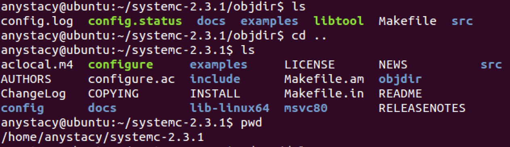
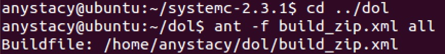
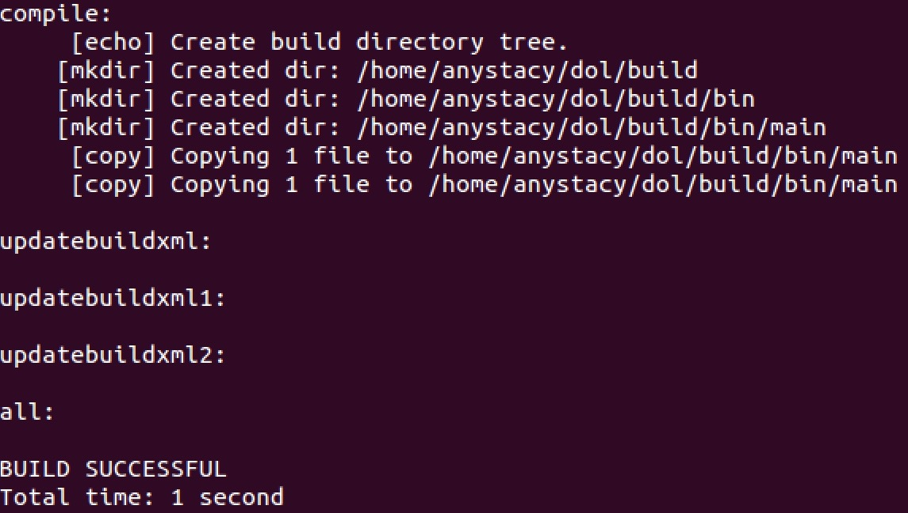

# DOL  徐艺宁 14353342 
本次报告是包括对DOL的概述、DOL安装过程中的安装笔记，和实验感想与心得。  
  
## Description
>DOL 框架描述(随着实验进行迭代添加、修改)  

**Distributed Operation Layer (DOL)**  
The distributed operation layer is a software development framework to program parallel applications. The DOL allows to specify applications based on the Kahn process network model of computation and features a simulation engine based on SystemC.   
Moreover, the DOL provides an XML-based specification format to describe the implementation of a parallel application on a multi-processor systems, including binding and mapping.

The distributed operation layer (DOL) is a framework that enables the (semi-) automatic mapping of applications onto the multiprocessor SHAPES architecture platform. The DOL consists of basically three parts:  

DOL Application Programming Interface  
DOL Functional Simulation  
DOL Mapping Optimization

## How to install
>DOL 安装笔记  

1. 配置C/C++ environment: compiler, linker  

2. Java environment: javac, java 配置  

3. Build environment: make, Ant 更新环境  

4. 安装与配置SystemC  

5. 配置DOL  
	- 进入DOL文件夹，根据当前路径修改build_zip.xml文件中路径    
	 
	- 用ant语句编译该文件  
	    
	  
	- 
	
## Experimental experience
>实验感想、实验心得

s
